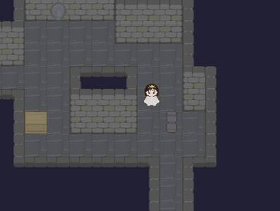

# Castle Escape
Game originally made for [Baixada Game Jam][BGJ-website], written in [Nelua][nelua-website] using [Raylib][raylib-website]

## Play

[JAM version on itch.io][itch-io-page]  
[post-JAM version on github][github-page]

## Creators

* [André Luiz Alvares][andre_la-github]: programmer
* [Leonardo Santos][leonardo-github]: pixel artist

## Special Thanks!

* [Eduardo Bart][edubart-github]: Helped us with the web building

## Dependencies

* [Nelua][nelua-install]
* [Raylib][raylib-install]

This project also uses these bundled libraries:
* [Raylib-nelua][raylib-nelua-repo-mirror]
* [Rotor-nelua][rotor-nelua-repo-mirror]

## Build and run

With default settings:
`$ nelua -r main.nelua`

Options:
* `DEFAULT_LANG: string`: either "en-US" or "pt-BR" (default is "en-US")
* `WIN_WIDTH: number`: any number (default is 800)
* `WIN_HEIGHT: number`: any number (default is 600)
* `WIN_TITLE: string`: any string (default is the "Castle Escape" text translated to the selected language on DEFAULT_LANG)
* `PL_POS_X: number`: any number (default is 28)
* `PL_POS_Y: number`: any number (default is 103)
* `PL_VEL: number`: any number (default is 2)
* `SHOW_DEV_INFO`: just define it to use
* `DRAW_FPS`: just define it to use
* `PROF`: (requires [nprof][nprof-repository]) just define it to use

Example:
`$ nelua -r "-D DEFAULT_LANG='pt-BR'" -D WIN_WIDTH=800 main.nelua`

[BGJ-website]: https://itch.io/jam/baixada-gamejam/
[itch-io-page]: https://andre-la.itch.io/castle-escape/
[github-page]: https://andre-la.github.io/baixada-game-jam-game/index.html
[nelua-website]: https://nelua.io/
[raylib-website]: https://www.raylib.com/

[andre_la-github]: https://github.com/Andre-LA/
[leonardo-github]: https://github.com/LeonardoApSantos/
[edubart-github]: https://github.com/edubart/

[nelua-install]: https://nelua.io/installing/
[raylib-install]: https://github.com/raysan5/raylib#build-and-installation/

[raylib-nelua-repo-mirror]: https://github.com/Andre-LA/raylib-nelua-mirror/
[rotor-nelua-repo-mirror]: https://github.com/Andre-LA/Rotor-nelua/
[nprof-repository]: https://github.com/Andre-LA/nprof/
